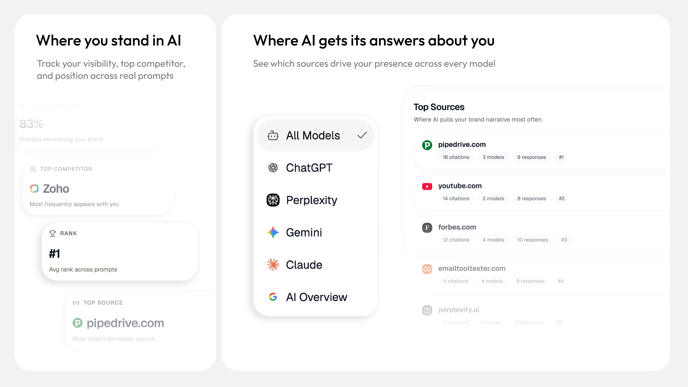
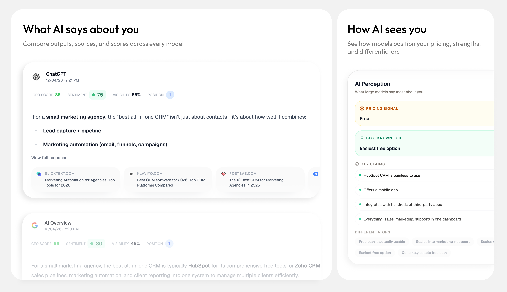
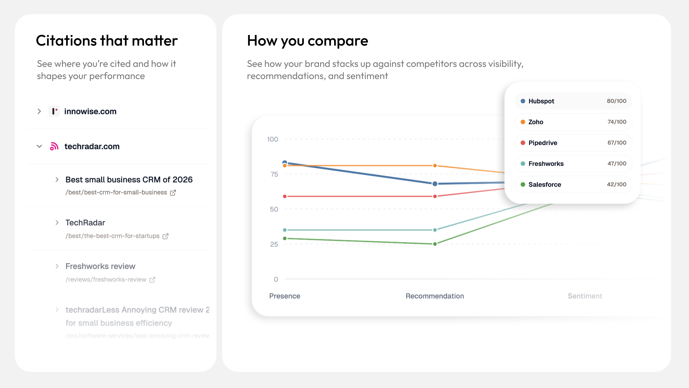
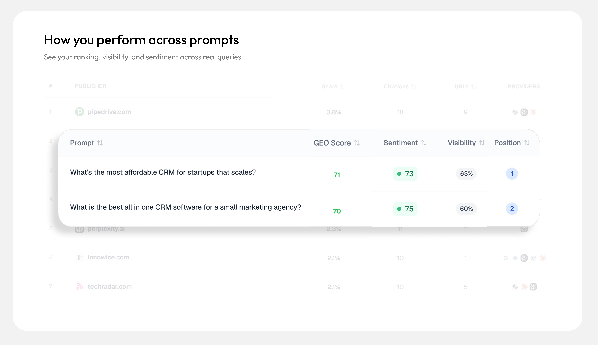

# OneGlanse

**Track how your brand appears inside real AI products — ChatGPT, Gemini, Perplexity, Claude, and Google AI Overview.**

[App](https://app.oneglanse.com) · [Docs](https://docs.oneglanse.com) · [oneglanse.com](https://oneglanse.com)

---

<p align="center">
  
  
</p>
<p align="center">
  
  
</p>

---

## What It Does

AI chat products don't use the same ranking signals as Google. When someone asks ChatGPT or Gemini to recommend a tool in your category, the answer depends on what those models know — and how prominently your brand appears in their responses.

OneGlanse runs your prompts inside the real UIs — not model APIs — and captures exactly what users see: the rendered response text, source citations, and which competitors appear alongside you. Every run is stored, analyzed with your own LLM API key, and turned into metrics you can track over time.

Fully open source. Everything runs in infrastructure you control.

---

## Features

- **Multi-provider monitoring** — ChatGPT, Gemini, Perplexity, Claude, Google AI Overview
- **UI-first capture** — responses captured from real product interfaces, not raw model APIs
- **Visibility & GEO scoring** — rank position, mention rate, sentiment, recommendation type
- **Competitor co-mentions** — see which brands appear alongside yours and how they're framed
- **Source & citation tracking** — which URLs and domains the AI is citing for your category
- **Response analysis** — powered by your own OpenAI or Anthropic API key
- **ClickHouse analytics** — fast, high-volume storage built for time-series response data
- **Self-hostable** — deploy the full stack on any VPS with a single command
- **Scheduled runs** — recurring prompt execution in self-host mode

---

## Your Data Stays Yours

> OneGlanse stores everything in databases you control — on your local machine or your own VPS. Provider auth sessions are held on your machine. Response analysis calls go directly from your infrastructure to OpenAI or Anthropic. Nothing passes through a third-party server.

OneGlanse uses your own provider accounts for browser authentication. No credentials are stored on external servers. The entire pipeline — from browser automation to analytics storage to LLM analysis — runs inside infrastructure you own and can audit.

---

## Quick Start

**Requirements:** Node.js 20+, pnpm 10+, Docker

```bash
git clone https://github.com/aryamantodkar/oneglanse
cd oneglanse
pnpm install
pnpm local
```

Opens at [http://localhost:3000](http://localhost:3000).

The script handles everything on first run: generates `.env`, starts Postgres / ClickHouse / Redis, runs database migrations, and bootstraps the Camoufox browser runtime. Once the app opens, go to `/providers` to connect your AI provider accounts.

For VPS self-hosting, provider auth setup, and all configuration options → **[docs.oneglanse.com](https://docs.oneglanse.com)**

---

## Stack

| Layer | Technology |
|---|---|
| Web app | Next.js 15, React 19, tRPC, Drizzle ORM |
| Browser worker | Camoufox, Playwright, BullMQ |
| Analytics DB | ClickHouse |
| Relational DB | PostgreSQL 16 |
| Queue | Redis |
| Auth | Better Auth |
| Response analysis | OpenAI or Anthropic (your key) |

---

## License

MIT
